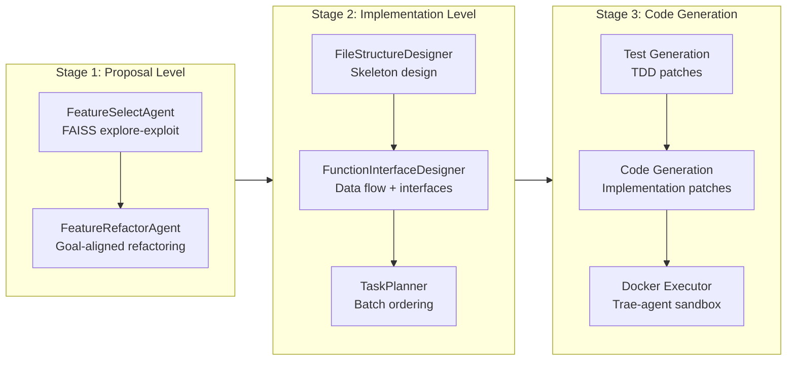
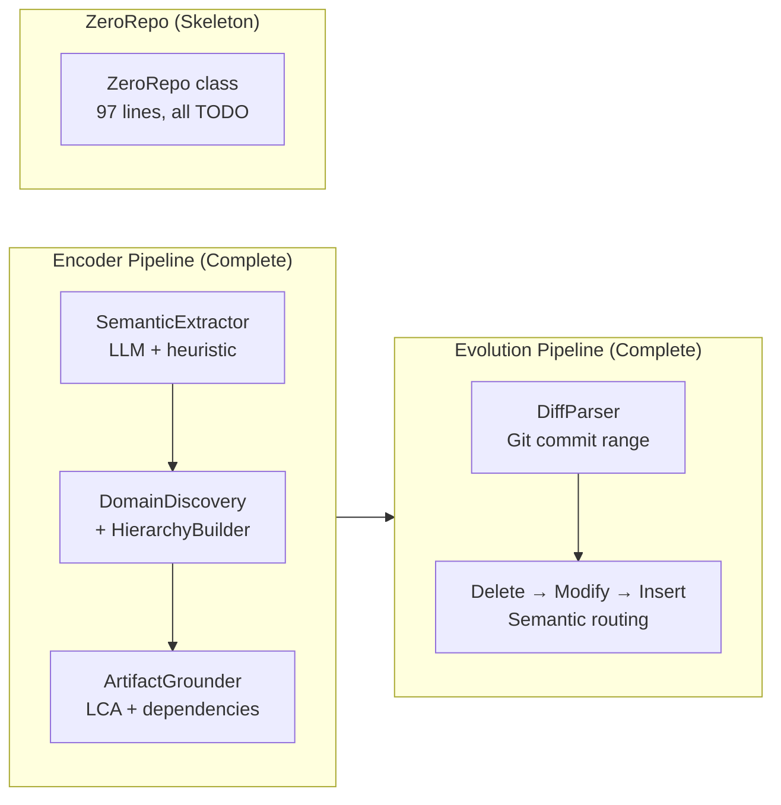

# Vendor RPG-ZeroRepo vs Our Implementation: Technical Comparison

This document compares the Microsoft RPG-ZeroRepo reference implementation (Python, `vendor/RPG-ZeroRepo/`) with our TypeScript implementation. While [`docs/implementation-status.md`](./implementation-status.md) tracks **paper vs implementation** status, this document focuses on **vendor code vs our code** — concrete technical differences, patterns, and improvement opportunities.

---

## 1. Executive Summary

| Dimension | Vendor (Python) | Ours (TypeScript) |
|-----------|----------------|-------------------|
| **Language** | Python 3.10+ monolithic package | TypeScript 5.x, Bun workspaces (8 packages) |
| **Source lines** | ~60,600 lines (.py) | ~13,200 lines (.ts, excluding tests) |
| **Encoder pipeline** | Fully implemented (rebuild, parse, refactor, evolve) | Fully implemented (3-phase encode, evolution, dependency graph, token-aware batching, type-aware call resolution) |
| **ZeroRepo pipeline** | Fully implemented (prop → impl → code gen) | Skeleton only (97 lines, all TODO) |
| **AST parsing** | Python `ast` module (Python-only) | tree-sitter (6 languages) |
| **Storage** | JSON files + FAISS (in-memory) | SQLite/SurrealDB + LanceDB (persistent) |
| **LLM providers** | 10 providers + Pydantic structured output | 5 providers + Zod structured output |
| **Type safety** | Runtime (dataclass + Pydantic) | Compile-time (Zod schemas + TypeScript strict) |

**Key takeaway**: Our Encoder implementation is feature-complete and paper-faithful with advantages in multi-language support, persistent storage, and semantic caching. The ZeroRepo generation pipeline is entirely unimplemented — the vendor codebase (~30K lines across `prop_level/`, `impl_level/`, `code_gen/`) represents the primary gap.

---

## 2. Architecture Overview

### 2.1 Vendor Pipeline (Python)



### 2.2 Our Pipeline (TypeScript)



### 2.3 Package/Module Mapping

| Vendor Module | Lines | Our Package | Lines | Coverage |
|---------------|-------|-------------|-------|----------|
| `rpg_gen/base/rpg/` | 3,046 | `@pleaseai/rpg-graph` | 1,106 | Equivalent (different design) |
| `rpg_encoder/` | 12,016 | `@pleaseai/rpg-encoder` | 5,174 | Functionally equivalent |
| `rpg_gen/base/llm_client/` | 2,064 | `@pleaseai/rpg-utils` (llm) | ~400 | Ours is leaner |
| `rpg_gen/base/unit/` + `rpg_gen/base/node/` | 2,131 | `@pleaseai/rpg-utils` (ast) | ~500 | Different approach |
| `utils/` | 8,653 | `@pleaseai/rpg-utils` | 1,580 | Ours is more focused |
| — | — | `@pleaseai/rpg-store` | 1,415 | No vendor equivalent |
| `rpg_encoder/rpg_agent/` | ~2,700 | `@pleaseai/rpg-tools` | 590 | Equivalent |
| — | — | `@pleaseai/rpg-mcp` | 2,497 | No vendor equivalent |
| `rpg_gen/prop_level/` | 3,137 | — | 0 | **Gap** |
| `rpg_gen/impl_level/` | 7,763 | — | 0 | **Gap** |
| `code_gen/` | 19,877 | — | 0 | **Gap** |
| `config/` | 223 | `.rpg/` directory | — | Different approach |

---

## 3. Data Structures

### 3.1 Node Model

| Aspect | Vendor | Ours |
|--------|--------|------|
| **Type** | Single `Node` dataclass | `HighLevelNode \| LowLevelNode` discriminated union |
| **Hierarchy** | `level: int` (L0–L5, `MAX_LEVEL=5`) | Binary: `type: 'high_level' \| 'low_level'` |
| **Identity** | `id: str`, `name: str` | `id: str` (no separate name) |
| **Feature** | `name: str` (flat string) | `SemanticFeature { description, subFeatures?, keywords? }` |
| **Metadata** | `NodeMetaData(type_name, path, description, content)` | `StructuralMetadata { entityType, path, startLine, endLine, qualifiedName, language, extra }` |
| **Source code** | Stored in `meta.content` | Separate `sourceCode?: string` field |
| **Graph ref** | `_graph: RPG` back-reference | No back-reference (traversal via RPG methods) |
| **Validation** | Runtime (dataclass) | Compile-time + runtime (Zod schema) |

**Vendor Node** (`vendor/RPG-ZeroRepo/zerorepo/rpg_gen/base/rpg/rpg.py:50-104`):
```python
@dataclass
class Node:
    id: str
    node_type: Optional[str] = None    # inferred from level
    name: str = ""
    level: Optional[int] = MAX_LEVEL   # 0=repo, 1-5=hierarchy depth
    unit: Optional[Tuple] = None       # CodeUnit reference
    meta: Optional[NodeMetaData] = None
    _graph: Optional["RPG"] = field(default=None, repr=False)
```

**Our Node** (`packages/graph/src/node.ts:83-103`):
```typescript
export const HighLevelNodeSchema = BaseNodeSchema.extend({
  type: z.literal('high_level'),
  directoryPath: z.string().optional(),
})
export const LowLevelNodeSchema = BaseNodeSchema.extend({
  type: z.literal('low_level'),
  metadata: StructuralMetadataSchema,   // required
  sourceCode: z.string().optional(),
})
```

**Analysis**: The vendor's 6-level hierarchy (L0–L5) maps naturally to real project depth, while our binary split is simpler but loses granularity. Our `SemanticFeature` is more structured (sub-features, keywords) vs vendor's flat `name` string. Our `StructuralMetadata` captures more positional detail (`startLine`, `endLine`, `qualifiedName`, `language`).

### 3.2 Edge Model

| Aspect | Vendor | Ours |
|--------|--------|------|
| **Types** | `EdgeType` enum: COMPOSES, CONTAINS, INHERITS, INVOKES, IMPORTS | `EdgeType`: functional, dependency + `DependencyType` subtypes |
| **Fields** | `src, dst, relation, meta` | `source, target, type` + type-specific fields |
| **Hierarchy** | COMPOSES/CONTAINS (synonymous) | `FunctionalEdge` (level, siblingOrder) |
| **Dependencies** | Separate enum values per type | `DependencyEdge { dependencyType: import\|call\|inherit\|implement\|use }` |
| **Data flow** | No dedicated type | `DataFlowEdge { from, to, dataId, dataType, transformation }` |
| **Metadata** | `meta: NodeMetaData` on edges | `isRuntime`, `line`, `weight` type-specific fields |

**Analysis**: Conceptually equivalent. Our design uses discriminated unions with type-specific fields; the vendor uses a flat edge with an enum. Our `DataFlowEdge` has no vendor counterpart — the vendor tracks data flow via the DependencyGraph's invocation/inheritance edges instead.

### 3.3 DependencyGraph

The vendor has a dedicated `DependencyGraph` class (`dep_graph.py`, 1,023 lines) built on `networkx.MultiDiGraph`. Our implementation now covers the same core capabilities (~2,110 lines across 7 files, PR #83 + PR #90):

```python
# Vendor: Python-only, networkx MultiDiGraph
class DependencyGraph:
    self.G: nx.MultiDiGraph()           # All edges
    self.G_tree: nx.subgraph_view()     # CONTAINS edges
    self.G_imports: nx.subgraph_view()  # IMPORTS edges
    self.G_invokes: nx.subgraph_view()  # INVOKES edges
    self.G_inherits: nx.subgraph_view() # INHERITS edges
```

```typescript
// Ours: multi-language (tree-sitter), array-based (calls[], inheritances[])
class DependencyGraph          // packages/encoder/src/dependency-graph.ts (196 lines)
class CallExtractor            // packages/encoder/src/call-extractor.ts (353 lines)
class InheritanceExtractor     // packages/encoder/src/inheritance-extractor.ts (393 lines)
class SymbolResolver           // packages/encoder/src/symbol-resolver.ts (240 lines)
injectDependencies             // packages/encoder/src/dependency-injection.ts (317 lines)
class TypeInferrer             // packages/encoder/src/type-inferrer.ts (345 lines)
                               // packages/encoder/src/type-inference-patterns.ts (266 lines)
```

**Key difference**: Ours uses tree-sitter (6 languages: TS, JS, Python, Rust, Go, Java) vs vendor's Python `ast` module (Python-only).

**Type-aware call resolution** (PR #90): `TypeInferrer` (`type-inferrer.ts`, 345 lines) provides `resolveQualifiedCall()` (the integration point used by `dependency-injection.ts`), backed by `inferLocalVarType()`, `inferAttributeType()`, and MRO traversal — achieving parity with the vendor's `_infer_local_var_type()` and `_infer_attribute_type()` methods. Note: full AST traversal is implemented for TypeScript, JavaScript, Python, and Java; Rust and Go use pattern-based inference only.

### 3.4 RepoNode Hierarchy (Vendor-Only, Generation Pipeline)

The vendor defines a file hierarchy for code generation:

```python
class RepoSkeleton:
    root: DirectoryNode
    path_to_node: Dict[str, RepoNode]

class DirectoryNode(RepoNode):   # name, path, children
class FileNode(RepoNode):        # name, path, code, code_map: Dict[str, CodeUnit]
```

This is a generation-pipeline concept with no equivalent in our encoder-focused codebase.

---

## 4. Encoder Pipeline Comparison

### 4.1 Semantic Lifting

| Aspect | Vendor (`rpg_encoding.py`, `semantic_parsing.py`) | Ours (`semantic.ts`, `encoder.ts`) |
|--------|--------------------------------------------------|-------------------------------------|
| **Batching** | Token-aware: `min_batch_tokens=10K`, `max_batch_tokens=50K` | Token-aware: `minBatchTokens=10K`, `maxBatchTokens=50K` (PR #82) |
| **Caching** | None | `SemanticCache`: SQLite-backed, 7-day TTL, MD5 hash validation |
| **LLM fallback** | LLM only (no heuristic) | LLM with heuristic fallback (regex-based) |
| **Iterations** | Multi-iteration: `max_parse_iters=10` | `maxParseIterations` (default 1, configurable) |
| **Output format** | Pydantic `BaseModel` structured output | Zod schema structured output |
| **AST parsing** | Python `ast` module (Python-only) | tree-sitter (TS, JS, Python, Rust, Go, Java) |
| **Parallelization** | Sequential within batch | Sequential (Bun single-threaded) |

**Analysis**: Both now use token-aware batching — grouping entities until a token budget is reached. Our caching layer provides significant cost savings on re-encodes that the vendor lacks entirely. Our `maxParseIterations` is configurable but defaults to 1 (vs vendor's default 10).

### 4.2 Structural Reorganization

| Aspect | Vendor (`refactor_tree.py`, 1,042 lines) | Ours (`domain-discovery.ts`, `hierarchy-builder.ts`) |
|--------|------------------------------------------|------------------------------------------------------|
| **Approach** | Iterative refinement with `max_refactor_iters` | Single LLM call for domain discovery + hierarchy |
| **Strategy** | Multi-round tree restructuring with validation | Two-step: discover domains → assign files to 3-level paths |
| **Compression** | Granularity-based input compression | Granularity-based input compression |
| **Validation** | LLM-based quality assessment per iteration | PascalCase validation, deduplication |
| **Fallback** | Retry with adjusted prompts | "Utilities" catch-all for unassigned files |

**Analysis**: The vendor's iterative approach (multiple LLM rounds with quality checks) can produce higher-quality hierarchies but at greater cost. Our single-pass approach is more efficient but may produce less refined structures.

### 4.3 Artifact Grounding

| Aspect | Vendor (`rpg.py` methods) | Ours (`grounding.ts`) |
|--------|--------------------------|------------------------|
| **Algorithm** | `backtrack_to_lcp_node()` with min_support threshold | `PathTrie` + LCA computation |
| **Path propagation** | `update_all_metadata_bottom_up()` | `ArtifactGrounder.propagate()` recursive |
| **Multi-path** | Support via `min_support` parameter | `metadata.extra.paths` for multiple LCAs |

**Analysis**: Both use LCA-based approaches. The vendor uses a statistical `min_support` threshold for common prefix extraction; ours uses a trie-based algorithm for exact LCA computation. Functionally equivalent.

### 4.4 Evolution (Incremental Updates)

| Aspect | Vendor (`RPGEvolution` in `rpg_encoder/`) | Ours (`evolution/` directory) |
|--------|------------------------------------------|-------------------------------|
| **Diff parsing** | Git diff + Python AST comparison | Git diff + tree-sitter entity extraction |
| **Operation order** | Delete → Modify → Insert | Delete → Modify → Insert (same) |
| **Semantic drift** | Cosine similarity threshold | `driftThreshold` (default 0.3) with re-routing |
| **Orphan pruning** | Bottom-up recursive removal | `pruneOrphans()` recursive removal |
| **Semantic routing** | LLM-based parent selection | `SemanticRouter` with LLM + embedding fallback |
| **Rebuild modes** | `FEATURE_ONLY`, `FEATURE_FILE`, `FULL_PRESERVE` | Single mode (always full encode) |

**Analysis**: Both implement the paper's Algorithm 1-3 faithfully. The vendor offers `RebuildMode` for partial re-encoding (preserve features while redesigning files), which our implementation doesn't have. Our semantic router includes an embedding-based fallback when LLM routing fails.

### 4.5 Dependency Analysis

| Aspect | Vendor (`dep_graph.py`, 1,023 lines) | Ours (`DependencyGraph`, ~2,110 lines, PR #83 + PR #90) |
|--------|--------------------------------------|------------------------------------------------|
| **Scope** | Imports + invocations + inheritance | Imports + invocations + inheritance |
| **Graph engine** | networkx `MultiDiGraph` with subgraph views | Array-based (`calls[]`, `inheritances[]`) with `DependencyEdge` records |
| **Language** | Python-only (uses `ast` module) | Multi-language (tree-sitter: 6 languages) |
| **Resolution** | Full symbol resolution with fuzzy matching | `SymbolResolver` (syntactic + case-insensitive fuzzy match) + `TypeInferrer` (type-aware for self/super/variable calls) |
| **Type inference** | `_infer_local_var_type()`, attribute tracking | `TypeInferrer.resolveQualifiedCall()` (via `inferLocalVarType()`, `inferAttributeType()`, MRO traversal) — full AST traversal for TS/JS/Python/Java; pattern-only for Rust/Go (PR #90) |
| **Call graph** | `G_invokes` subgraph view | `CallExtractor` → `DependencyEdge { dependencyType: 'call' }` |
| **Class hierarchy** | `G_inherits` with MRO traversal | `InheritanceExtractor` → `DependencyEdge { dependencyType: 'inherit' }` |

**Analysis**: Both implementations now track imports, invocations, and inheritance at parity. The vendor's approach is Python-specific (relies on `ast` module), while ours works across 6 languages via tree-sitter. Type-aware call resolution (`self.method()`, `super()`, variable type inference, MRO) is implemented via `TypeInferrer` (PR #90), matching the vendor's capability.

---

## 5. ZeroRepo Generation Pipeline (Gap Analysis)

The entire generation pipeline (~30,777 lines) exists in the vendor but is absent from our codebase (97-line skeleton).

### 5.1 Stage 1: Proposal Level (`prop_level/`, 3,137 lines)

| Component | Vendor File | Lines | Key Classes | Our Status |
|-----------|-------------|-------|-------------|------------|
| **PropBuilder** | `prop_builder.py` | 242 | `PropBuilder` | Not implemented |
| **Feature Selection** | `select_feature/select_agent.py` | 1,050 | `FeatureSelectAgent` | Not implemented |
| **FAISS Explore-Exploit** | `select_feature/faiss_db.py` | ~200 | `FAISSDatabase` | Not implemented |
| **Feature Refactoring** | `refactor_feature/refactor_agent.py` | ~800 | `FeatureRefactorAgent` | Not implemented |
| **Prompts** | `select_feature/prompt.py`, `refactor_feature/prompt.py` | ~800 | Prompt templates | Not implemented |

**How it works**:
1. `FeatureSelectAgent.iterate_feature_tree()` builds a feature tree through LLM-based exploration with configurable `explore_conditions` (breadth/depth control)
2. FAISS vector database enables explore-exploit balance — sampling diverse features while focusing on goal-relevant ones
3. `FeatureRefactorAgent.refactor_feature_tree()` reorganizes the tree for high cohesion and low coupling

### 5.2 Stage 2: Implementation Level (`impl_level/`, 7,763 lines)

| Component | Vendor File | Lines | Key Classes | Our Status |
|-----------|-------------|-------|-------------|------------|
| **ImplBuilder** | `impl_builder.py` | ~300 | `ImplBuilder` | Not implemented |
| **File Design** | `file_design/` | ~1,500 | `FileStructureDesigner` | Not implemented |
| **Function Design** | `func_design/` | ~3,000 | `FunctionInterfaceDesigner`, interface agents | Not implemented |
| **Task Planning** | `plan_tasks/` | ~2,900 | `TaskManager`, `TaskBatch`, `TaskPlanner` | Not implemented |

**How it works**:
1. `FileStructureDesigner` converts feature tree → directory/file skeleton (`RepoSkeleton`)
2. `FunctionInterfaceDesigner` designs function signatures, data flows, and interfaces for each file
3. `TaskPlanner` creates dependency-ordered `TaskBatch` groups for parallel execution

### 5.3 Stage 3: Code Generation (`code_gen/`, 19,877 lines)

| Component | Vendor File | Lines | Key Classes | Our Status |
|-----------|-------------|-------|-------------|------------|
| **Code Generator** | `code_gen.py` | 1,818 | `IterativeCodeGenerator` | Not implemented |
| **Docker Container** | `ct_builder.py` | 451 | Docker sandbox management | Not implemented |
| **Trae-Agent** | `trae-agent/` | ~15,000 | Agent framework, tool system | Not implemented |
| **Runner** | `runner.py` | 385 | Test/code execution | Not implemented |
| **Prompts** | `prompts/` | ~1,500 | Generation prompt templates | Not implemented |

**How it works**:
1. For each `TaskBatch`, generate test patches first (TDD approach)
2. Generate implementation code patches to satisfy tests
3. Execute in Docker container for isolation; analyze failures with LLM
4. `IterativeCodeGenerator` retries with `max_iterations=5` and `max_retries_per_workflow=3`
5. `PersistentTaskExecutor` reuses Docker containers across batches for efficiency

---

## 6. Supporting Infrastructure Comparison

### 6.1 LLM Integration

| Aspect | Vendor | Ours |
|--------|--------|------|
| **Providers** | OpenAI, Anthropic, Google, Azure, DeepSeek, vLLM, OpenRouter, Ollama, Doubao (10) | OpenAI, Anthropic, Google, Claude Code, Codex CLI (5) |
| **Structured output** | Pydantic `BaseModel` → JSON schema | Zod schema → `completeJSON<T>()` |
| **Memory** | `Memory` class (context window, persistence, snapshots) | None (stateless per-call) |
| **Retry** | `max_retries: int = 3` with backoff | Via AI SDK built-in retry |
| **Cost tracking** | None | `getUsageStats()` + `estimateCost()` per-model pricing |
| **Config** | `LLMConfig` dataclass | `SemanticOptions` + provider auto-detection |

**Analysis**: The vendor supports more providers but lacks cost tracking. Our `Claude Code` and `Codex CLI` providers (no API key needed for Pro/Max subscribers) are unique. The vendor's `Memory` class enables multi-turn agent conversations — useful for the generation pipeline's iterative workflows.

### 6.2 Agent Framework

| Aspect | Vendor (Trae-Agent) | Ours (MCP Tools) |
|--------|---------------------|-------------------|
| **Architecture** | Custom agent framework with tool registration | MCP (Model Context Protocol) server |
| **Tools** | Tool classes with `execute()` methods | MCP tool handlers with Zod schemas |
| **Execution** | Direct Python function calls | JSON-RPC over stdio |
| **Sandbox** | Docker container isolation | None (host execution) |
| **State** | `Memory` class for conversation history | Stateless per-request |

### 6.3 Storage & Persistence

| Aspect | Vendor | Ours |
|--------|--------|------|
| **Graph storage** | JSON files (`save_json()`/`load_json()`) | SQLite (WAL mode) / SurrealDB (mem:// or surrealkv://) |
| **Vector search** | FAISS (in-memory) | LanceDB (disk-based, Bun-native) |
| **Text search** | None | FTS5 (SQLite) / BM25 (SurrealDB) |
| **Caching** | None | SemanticCache (SQLite, 7-day TTL, MD5 hash) |
| **Checkpoints** | `CheckpointManager` with named file slots | `.rpg/` directory structure |
| **Serialization** | `to_dict()`/`from_dict()` + JSON | `serialize()`/`deserialize()` + JSON |

**Analysis**: Our storage layer is significantly more robust — persistent databases vs JSON files, full-text search capabilities, and semantic caching. The vendor's `CheckpointManager` provides structured checkpoint/resume for long-running pipelines, which our simpler `.rpg/` directory doesn't replicate.

### 6.4 Configuration

| Aspect | Vendor | Ours |
|--------|--------|------|
| **Format** | YAML config files | `.rpg/config.json` |
| **Checkpoint** | `CheckpointManager` + `CheckpointFiles` dataclass | `.rpg/local/state.json` |
| **Pipeline state** | `pipeline_state` dict with stage completion flags | `config.github.commit` SHA tracking |
| **Resume** | Stage-level resume (skip completed stages) | `rpg sync --force` for full rebuild |

---

## 7. Improvements Identified

### 7.1 From Vendor → Our Implementation

| Priority | Improvement | Vendor Source | Impact |
|----------|-------------|---------------|--------|
| **P0** | ZeroRepo generation pipeline (prop → impl → code gen) | `rpg_gen/prop_level/`, `rpg_gen/impl_level/`, `code_gen/` (~30K lines) | Enables code generation from specifications |
| ✅ **P1** | DependencyGraph (invocation + inheritance tracking) | `base/rpg/dep_graph.py` (1,023 lines) | Done (PR #83) |
| ✅ **P1** | Type-aware call resolution (TypeInferrer, MRO traversal) | `base/rpg/dep_graph.py` (`_infer_local_var_type()`, `_infer_attribute_type()`) | Done (PR #90) |
| ✅ **P1** | Token-aware batch semantic extraction | `rpg_encoder/rpg_parsing/rpg_encoding.py` | Done (PR #82) |
| **P1** | Checkpoint/resume system for long pipelines | `config/checkpoint_config.py` | Resilience for multi-hour encoding jobs |
| **P1** | Memory class for multi-turn agent conversations | `base/llm_client/memory.py` (144 lines) | Enables iterative agent workflows |
| **P2** | Explore-exploit feature selection with FAISS | `prop_level/select_feature/faiss_db.py` | Feature diversity in generation |
| **P2** | RPG visualization (`visualize_dir_map`) | `base/rpg/rpg.py` | Debugging and validation |
| **P2** | RebuildMode (FEATURE_ONLY, FEATURE_FILE, FULL_PRESERVE) | `rpg_encoder/rebuild.py` | Flexible partial re-encoding |
| **P3** | RepoCraft benchmark framework | `repocraft/` | Quality evaluation pipeline |

### 7.2 Our Advantages over Vendor

| Advantage | Details |
|-----------|---------|
| **Multi-language AST** | tree-sitter supports 6 languages (TS, JS, Python, Rust, Go, Java) vs vendor's Python-only `ast` module |
| **Persistent storage** | SQLite/SurrealDB/LanceDB with WAL mode and indices vs vendor's JSON-only persistence |
| **Semantic caching** | 7-day TTL, content-hash validated, SQLite-backed cache — completely absent in vendor |
| **Full-text search** | FTS5 (SQLite) + BM25 (SurrealDB) — no equivalent in vendor |
| **Hybrid search** | Combined vector similarity + BM25 text search — vendor has FAISS only (vector) |
| **Evolution system** | Paper-faithful delete→modify→insert with drift detection and semantic routing |
| **MCP integration** | Native Claude Code integration via MCP server (6 tools) — no vendor equivalent |
| **Structured LLM output** | Zod schema → `Output.object()` validated structured output via `completeJSON<T>()` — vendor uses Pydantic BaseModel |
| **Type safety** | Zod schemas + TypeScript strict mode provide compile-time guarantees |
| **Cost tracking** | Per-model pricing estimation with `estimateCost()` — absent in vendor |
| **Two-tier data management** | CI-committed canonical graph + local-only evolved copy — vendor has flat JSON |
| **CLI integration** | `rpg init`, `rpg sync`, `rpg stamp`, `rpg last-commit` for CI workflows |

---

## 8. Appendix A: File Mapping Table

| Vendor File | Lines | Our Equivalent | Notes |
|-------------|-------|----------------|-------|
| `rpg_gen/base/rpg/rpg.py` | 1,760 | `packages/graph/src/rpg.ts` (571 lines) | Core RPG class |
| `rpg_gen/base/rpg/dep_graph.py` | 1,023 | `packages/encoder/src/dependency-graph.ts` (196 lines) + `call-extractor.ts` (353) + `inheritance-extractor.ts` (393) + `symbol-resolver.ts` (240) + `dependency-injection.ts` (317) + `type-inferrer.ts` (345) + `type-inference-patterns.ts` (266) | Implemented (PR #83 + PR #90) |
| `rpg_gen/base/rpg/util.py` | 257 | `packages/graph/src/node.ts`, `edge.ts` | Enums + utilities |
| `rpg_gen/base/unit/code_unit.py` | 577 | `packages/utils/src/ast/types.ts` | `CodeEntity` interface |
| `rpg_gen/base/node/skeleton.py` | ~500 | — | **Gap**: Generation-only |
| `rpg_gen/base/node/node.py` | ~420 | — | **Gap**: Generation-only |
| `rpg_gen/base/llm_client/client.py` | ~500 | `packages/utils/src/llm.ts` (~400 lines) | LLM provider routing |
| `rpg_gen/base/llm_client/memory.py` | 144 | — | **Gap**: No conversation memory |
| `rpg_encoder/rpg_encoding.py` | 796 | `packages/encoder/src/semantic.ts` | Semantic lifting |
| `rpg_encoder/semantic_parsing.py` | 824 | `packages/encoder/src/semantic.ts` | Entity feature extraction |
| `rpg_encoder/refactor_tree.py` | 1,042 | `packages/encoder/src/reorganization/` | Structural reorganization |
| `rpg_encoder/rebuild.py` | 1,761 | `packages/encoder/src/encoder.ts` (1,048 lines) | Main encoder orchestration |
| `rpg_encoder/rpg_agent/ops/search_node_by_meta.py` | 946 | `packages/tools/src/search.ts` | SearchNode tool |
| `rpg_encoder/rpg_agent/ops/fetch_node.py` | 700 | `packages/tools/src/fetch.ts` | FetchNode tool |
| `rpg_encoder/rpg_agent/ops/explore_rpg.py` | 1,071 | `packages/tools/src/explore.ts` | ExploreRPG tool |
| `rpg_gen/prop_level/prop_builder.py` | 242 | — | **Gap**: Proposal builder |
| `rpg_gen/prop_level/select_feature/select_agent.py` | 1,050 | — | **Gap**: Feature selection |
| `rpg_gen/prop_level/select_feature/faiss_db.py` | ~200 | — | **Gap**: FAISS explore-exploit |
| `rpg_gen/prop_level/refactor_feature/refactor_agent.py` | ~800 | — | **Gap**: Feature refactoring |
| `rpg_gen/impl_level/impl_builder.py` | ~300 | — | **Gap**: Implementation builder |
| `rpg_gen/impl_level/file_design/` | ~1,500 | — | **Gap**: Skeleton design |
| `rpg_gen/impl_level/func_design/` | ~3,000 | — | **Gap**: Function design |
| `rpg_gen/impl_level/plan_tasks/task_manager.py` | 1,179 | — | **Gap**: Task management |
| `code_gen/code_gen.py` | 1,818 | — | **Gap**: Code generation |
| `code_gen/ct_builder.py` | 451 | — | **Gap**: Docker sandbox |
| `code_gen/runner.py` | 385 | — | **Gap**: Execution runner |
| `code_gen/trae-agent/` | ~15,000 | — | **Gap**: Agent framework |
| `config/checkpoint_config.py` | 223 | `.rpg/config.json` + CLI commands | Different approach |
| `utils/tree.py` | 722 | — | Feature tree utilities |
| `utils/repo_index/index/code_index.py` | 832 | `packages/utils/src/ast/parser.ts` | Code indexing |
| — | — | `packages/store/src/sqlite/` | **Our addition**: Persistent graph store |
| — | — | `packages/store/src/lancedb/` | **Our addition**: Vector store |
| — | — | `packages/encoder/src/cache.ts` | **Our addition**: Semantic cache |
| — | — | `packages/encoder/src/dependency-graph.ts` (196 lines) | **Our addition**: DependencyGraph class (PR #83) |
| — | — | `packages/encoder/src/call-extractor.ts` (353 lines) | **Our addition**: Call/invocation extraction (PR #83 + PR #90) |
| — | — | `packages/encoder/src/inheritance-extractor.ts` (393 lines) | **Our addition**: Class hierarchy extraction (PR #83) |
| — | — | `packages/encoder/src/symbol-resolver.ts` (240 lines) | **Our addition**: Symbol resolution (PR #83) |
| — | — | `packages/encoder/src/dependency-injection.ts` (317 lines) | **Our addition**: Import path resolution + graph edge injection orchestration (PR #83 + PR #90) |
| — | — | `packages/encoder/src/type-inferrer.ts` (345 lines) | **Our addition**: Type-aware call resolution (inferLocalVarType, inferAttributeType, MRO) (PR #90) |
| — | — | `packages/encoder/src/type-inference-patterns.ts` (266 lines) | **Our addition**: Language-specific type inference patterns (PR #90) |
| — | — | `packages/encoder/src/token-counter.ts` (57 lines) | **Our addition**: Token counting for batch sizing (PR #82) |
| — | — | `packages/mcp/src/` | **Our addition**: MCP server |

---

## 9. Appendix B: Terminology Mapping

| Vendor Term | Our Term | Notes |
|-------------|----------|-------|
| `Node` (with `level`) | `HighLevelNode` / `LowLevelNode` | Binary vs 6-level |
| `Node.name` | `SemanticFeature.description` | Flat string vs structured |
| `NodeMetaData` | `StructuralMetadata` | Different field sets |
| `NodeType` enum | `EntityType` const object | Same concept |
| `EdgeType.COMPOSES` / `CONTAINS` | `EdgeType.Functional` | Hierarchy edge |
| `EdgeType.IMPORTS` | `DependencyEdge { dependencyType: 'import' }` | Typed subclass |
| `EdgeType.INVOKES` | `DependencyEdge { dependencyType: 'call' }` | Implemented via `CallExtractor` (PR #83) + `TypeInferrer` for type-aware resolution (PR #90) |
| `EdgeType.INHERITS` | `DependencyEdge { dependencyType: 'inherit' }` | Implemented via `InheritanceExtractor` (PR #83) |
| `DependencyGraph` | `DependencyGraph` class (`packages/encoder/src/dependency-graph.ts`) | Implemented (PR #83); multi-language via tree-sitter |
| `RPG.save_json()` | `rpg.toJSON()` / `rpg.serialize()` | Serialization |
| `RPG.from_dict()` | `RepositoryPlanningGraph.deserialize()` | Deserialization |
| `RPG.visualize_dir_map()` | No equivalent | **Gap** |
| `CodeUnit` | `CodeEntity` (from AST parser) | Analysis unit |
| `RepoSkeleton` / `DirectoryNode` / `FileNode` | No equivalent | Generation pipeline |
| `PropBuilder` | Not implemented | Generation pipeline |
| `ImplBuilder` | Not implemented | Generation pipeline |
| `IterativeCodeGenerator` | Not implemented | Generation pipeline |
| `TaskBatch` | Not implemented | Generation pipeline |
| `CheckpointManager` | `.rpg/` directory | Different design |
| `Memory` (LLM conversation) | No equivalent | **Gap** |
| `LLMConfig` | `SemanticOptions` | LLM configuration |
| `ParseFeatures` (semantic parsing) | `SemanticExtractor` | Feature extraction |
| `RefactorTree` | `DomainDiscovery` + `HierarchyBuilder` | Reorganization |
| `backtrack_to_lcp_node()` | `ArtifactGrounder` + `PathTrie` | LCA computation |
| `RPGEvolution` | `RPGEvolver` | Incremental updates |
| `Rebuild` | `RPGEncoder.encode()` | Full encoding |
| `SemanticCache` (ours only) | — | No vendor equivalent |
| `ContextStore` (ours only) | — | No vendor equivalent |
